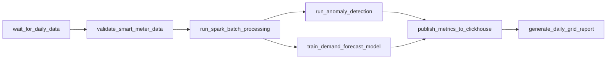

# Apache Airflow Orchestration for Smart Energy Analytics

## Overview
This directory contains the scheduled workflow orchestration components for batch data ingestion, daily historical aggregations, anomaly detection, machine learning model retraining, and reporting.

---

## DAG Architecture (`dags/smart_energy_pipeline.py`)

The pipeline executes daily at midnight (`@daily` or `0 2 * * *`) and follows this sequence:



### Tasks Description
1. `wait_for_daily_data`: FileSensor checking for daily telemetry dumps in `/data/raw`.
2. `validate_smart_meter_data`: Verifies integrity, missing timestamps, and file checksums.
3. `run_spark_batch_processing`: Triggers `spark/jobs/batch_job.py` to compute hourly and daily rollups.
4. `run_anomaly_detection`: Executes `spark/jobs/anomaly_detection.py` to flag abnormal power swings.
5. `train_demand_forecast_model`: Executes `spark/jobs/forecasting.py` to retrain GBT forecasting models.
6. `publish_metrics_to_clickhouse`: Refreshes materialized views and validates row count parity in ClickHouse.
7. `generate_daily_grid_report`: Compiles daily summary statistics and dispatches alerts if critical anomalies exceed threshold.

---

## Quickstart Guide

```bash
# Set Airflow home
export AIRFLOW_HOME=$(pwd)/airflow

# Initialize Airflow DB
airflow db init

# Start Airflow Webserver
airflow webserver --port 8085

# Start Airflow Scheduler
airflow scheduler
```
Access the Airflow UI at `http://localhost:8085` (default user: `admin` / `admin`).
